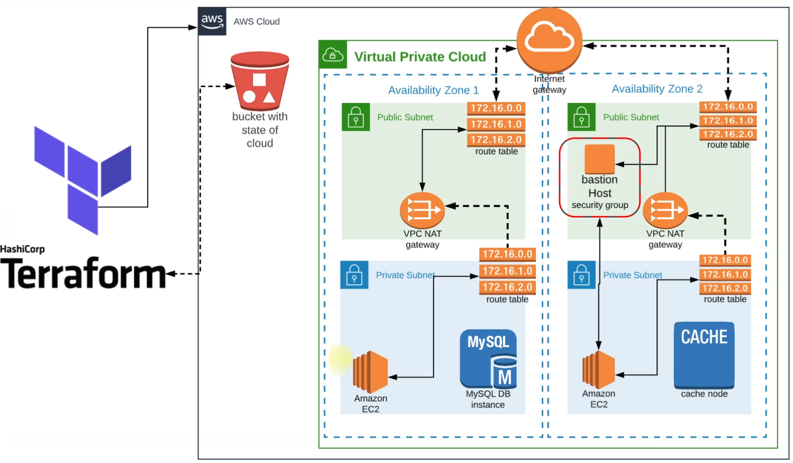

# Prerequisites
#
- JDK 11 
- Maven 3 
- MySQL 8

# Technologies 
- Spring MVC
- Spring Security
- Spring Data JPA
- Maven
- JSP
- Tomcat
- MySQL
- Memcached
- Rabbitmq
- ElasticSearch
# Database
Here,we used Mysql DB 
sql dump file:
- /src/main/resources/db_backup.sql
- db_backup.sql file is a mysql dump file.we have to import this dump to mysql db server
- > mysql -u <user_name> -p accounts < db_backup.sql
######################################################################################

# Cloud State Management by Terraform on AWS

## 🌐 Complete Infrastructure Setup
This project demonstrates a **cloud-native AWS infrastructure** fully automated with **Terraform**.  
It provisions and manages:
- **VPC**  
- **Subnets**  
- **Security Groups**  
- **Keypairs**  
- **Amazon RDS (MySQL)**  
- **Amazon ElastiCache (Memcached)**  
- **Amazon MQ (RabbitMQ)**  
- **Elastic Beanstalk Application**  
- **Bastion Host**  

---

## 🚀 Automating AWS Cloud Infrastructure with Terraform

### Step-by-Step Implementation

🔸 **Step 0**: Installed Terraform, created an AWS IAM user, and ran `aws configure` to securely connect to AWS services.  
🔸 **Step 1**: Defined a Terraform file to generate the **AMI ID** for EC2 instances.  
🔸 **Step 2**: Generated an **SSH key** locally and stored it in AWS using `aws_key_pair`.  
🔸 **Step 3**: Configured the **AWS provider** with the desired region.  
🔸 **Step 4**: Set up a **remote backend with S3** for centralized state management.  
🔸 **Step 5**: Organized **variables in vars.tf** for flexibility and reusability.  
🔸 **Step 6**: Deployed a **highly available VPC** with public & private subnets across multiple AZs using the Terraform Registry **VPC module**.  
🔸 **Step 7**: Created **security groups** for Bastion Host, backend services, Elastic Beanstalk EC2 instances, and load balancers.  
🔸 **Step 8**: Provisioned backend services (via Terraform modules):  
- Amazon RDS (MySQL)  
- Amazon MQ (RabbitMQ)  
- Amazon ElastiCache (Memcached)  

🔸 **Step 9**: Defined the **Elastic Beanstalk application and environment** in Terraform.  
🔸 **Step 10**: Configured the **Bastion Host** to initialize the RDS database.  
🔸 **Step 11**: Updated the app source code with **backend connection details**.  
🔸 **Step 12**: Created a `templates/` folder with **db_deploy.tmpl**, containing DB resources for RDS initialization.  
🔸 **Step 13**: Used **Terraform provisioners**:  
- File provisioner → Uploads `db_deploy.tmpl` to Bastion host  
- Remote-exec provisioner → Executes script on Bastion via SSH to initialize RDS  

🔸 **Step 14**: Packaged the **Java app with Maven** and generated artifacts.  
🔸 **Step 15**: Deployed the artifact to **Elastic Beanstalk**.  
🔸 **Step 16**: Verified via **Elastic Beanstalk domain** with live testing.  

---

## 📂 Source Code
- [Terraform Project Repository](https://github.com/azizi-devops/Terraform/)

---

## 🎯 Key Learnings
- Terraform for Infrastructure as Code (IaC)  
- AWS Elastic Beanstalk for app deployment  
- Secure database initialization with Bastion host & provisioners  
- Remote state management using S3 backend  
- Automated backend services setup (RDS, ElastiCache, ActiveMQ)  
- End-to-end CI/CD ready infrastructure provisioning  

---

✨ This project showcases how to **automate full AWS infrastructure with Terraform** and provision a production-ready environment in minutes.
